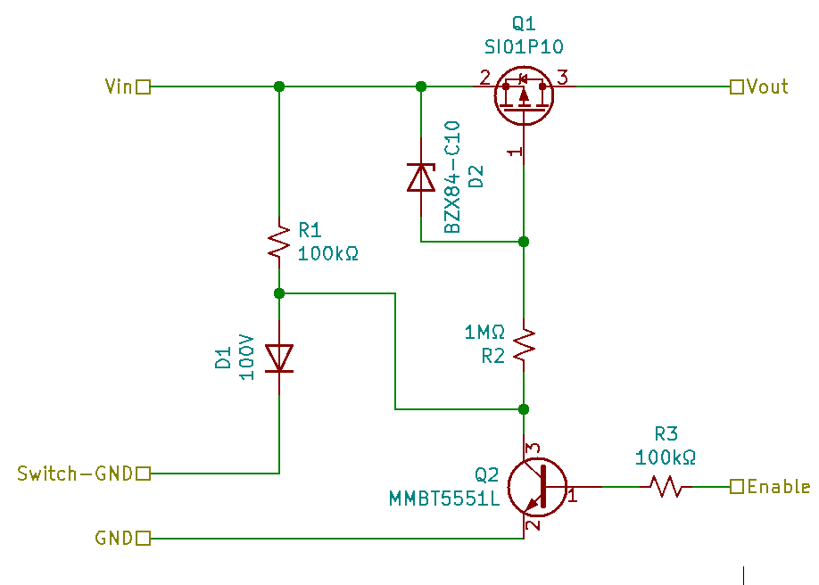
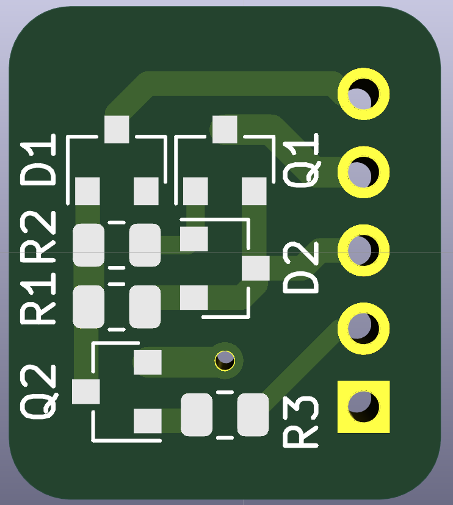
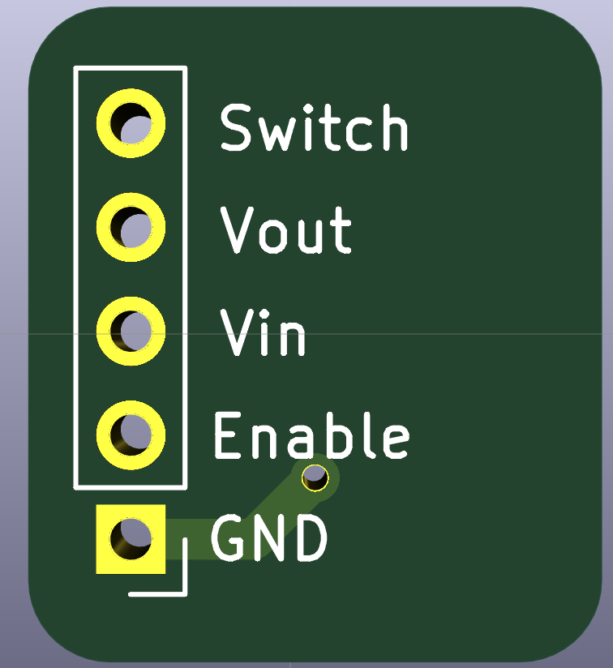

# Wide Voltage Soft Latch
This simple circuit is designed to be a safe (low current) way of activating a battery-based circuit for up to 100V.  A momentary switch connecting the `Switch` pin to `GND` activates the circuit.

# Details
* Minimalistic: only 7 components
* Connects directly to a battery
* Intended to turn on volatage regulator (up to 1A) for an MCU
* `Enable` pin connects to an MCU to allow for the circuit to deactivate itself

# Notes
1. The circuit relies on an MCU to pull the `Enable` pin low, therefore to ensure proper operation, during initalization the MCU should...
  * Check if the MCU was reset by the watchdog timer (AVR uses an `MCUCSR` flag) and pull the `Enable` pin either high or low, depending on the state.
  * Set the MCU's watchdog timer which will automatically reset the MCU (and thus turn off the circuit) if your code gets stuck.
2. Cheap 0.1" pins typically max out at 3A and 100V, so if you modify this for current exceeding 3A or voltage exceeding 100V then either integrate it into your circuit or select pins carefully.

# Schematic

# PCB

